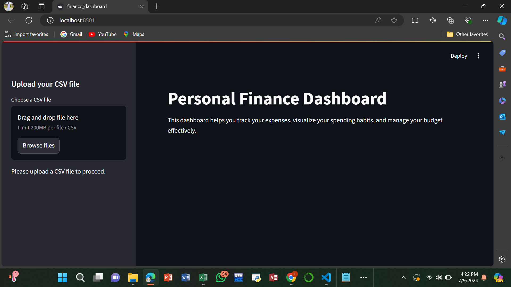
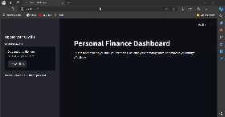

# Personal Finance Dashboard



## Overview

Welcome to the Personal Finance Dashboard! This project aims to help users manage their personal finances effectively. With this dashboard, you can track your expenses, visualize your spending habits, and manage your budget with ease.

## Features

- **Expense Tracking**: Upload your CSV file containing expense data and get detailed insights.
- **Spending by Category**: Visualize your spending across different categories.
- **Monthly Spending Trends**: See how your spending changes month over month.
- **Spending Over Time**: Analyze your daily spending patterns.

## Demo



## Installation

To run this project locally, follow these steps:

1. **Clone the repository:**
   ```bash
   git clone https://github.com/inayatrahimdev/Personal-Finance-Repository.git
   cd Personal-Finance-Repository
Install the required libraries:


pip install streamlit pandas matplotlib seaborn
Run the Streamlit app:

streamlit run finance_dashboard.py
Open the app in your browser:
After running the above command, Streamlit will start a local web server and provide you with a URL (usually http://localhost:8501). Open this URL in your web browser to see your Personal Finance Dashboard in action.

Usage
Upload CSV File: Upload your expense data in CSV format.
Visualize Data: View detailed visualizations of your spending habits.
Analyze Trends: Understand your spending patterns over time.
CSV File Format
Make sure your CSV file has the following columns for the app to work correctly:

• Date: The date of the transaction (format: dd/mm/yyyy).
• Amount: The amount spent.
• Category: The category of the expense (e.g., Food, Rent, Entertainment).
Contributing
We welcome contributions! If you'd like to contribute, please fork the repository and use a feature branch. Pull requests are warmly welcome.

Fork the repository
Create your feature branch:
git checkout -b feature/YourFeature
Commit your changes:
git commit -m 'Add some feature'
Push to the branch:
git push origin feature/YourFeature
Create a new Pull Request
License
This project is licensed under the MIT License. See the LICENSE file for details.

Contact
For any questions or suggestions, feel free to contact me:

• Email: inayatrahim006@gmail.com
Thank you for visiting the Personal Finance Dashboard repository! If you found this project useful, please consider giving it a star ⭐️.


Thank you for visiting the Personal Finance Dashboard repository! If you found this project useful, please consider giving it a star ⭐️.

